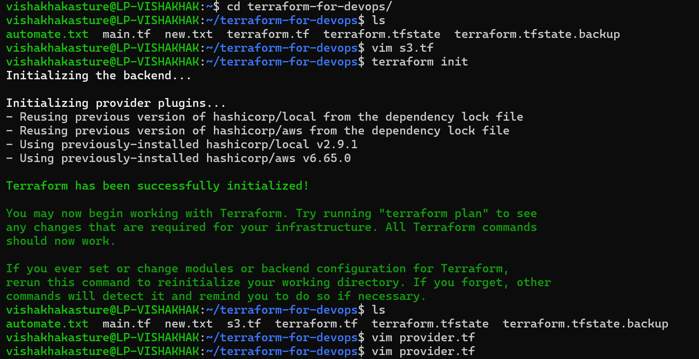
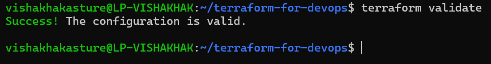
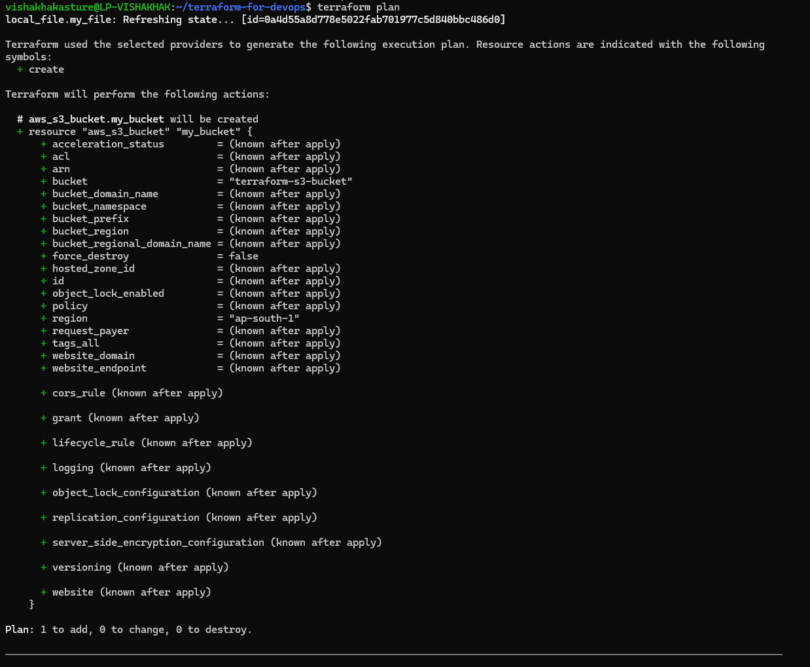
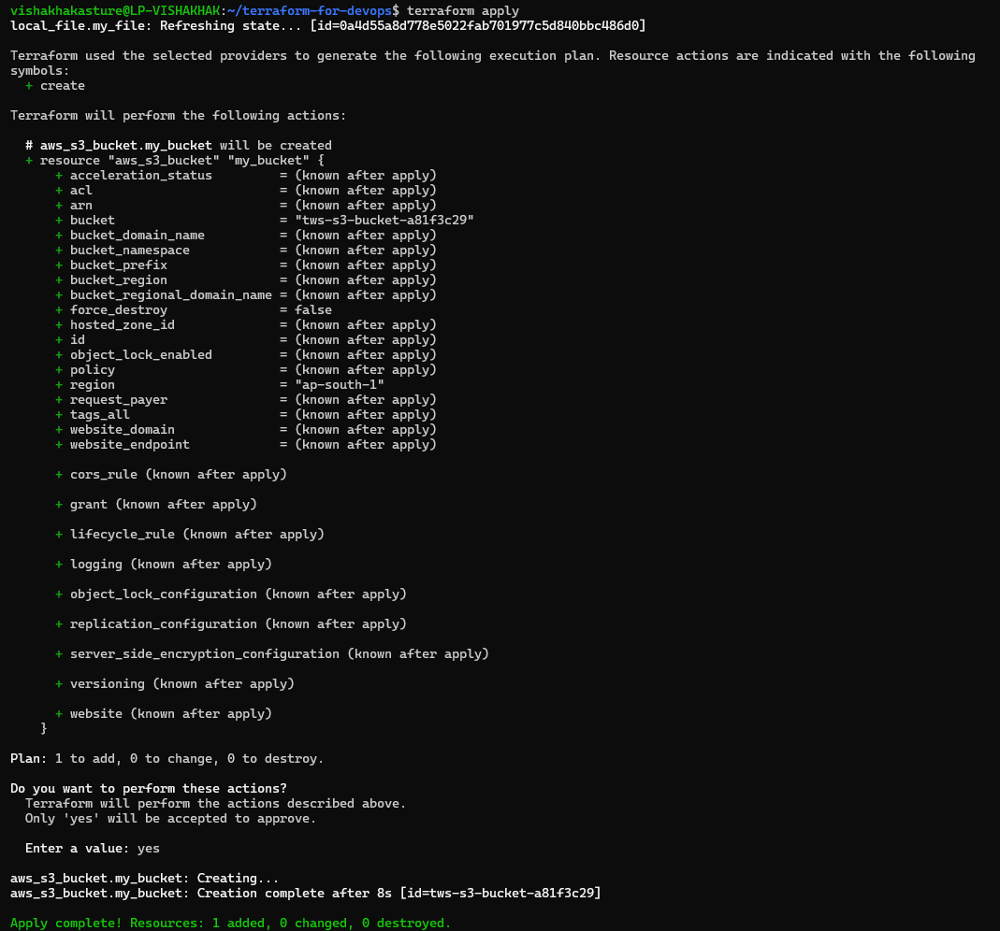
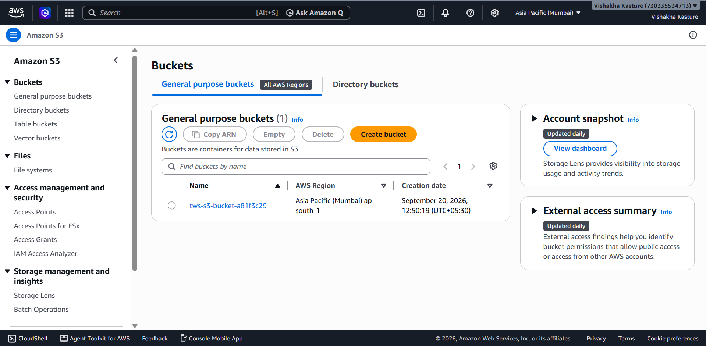
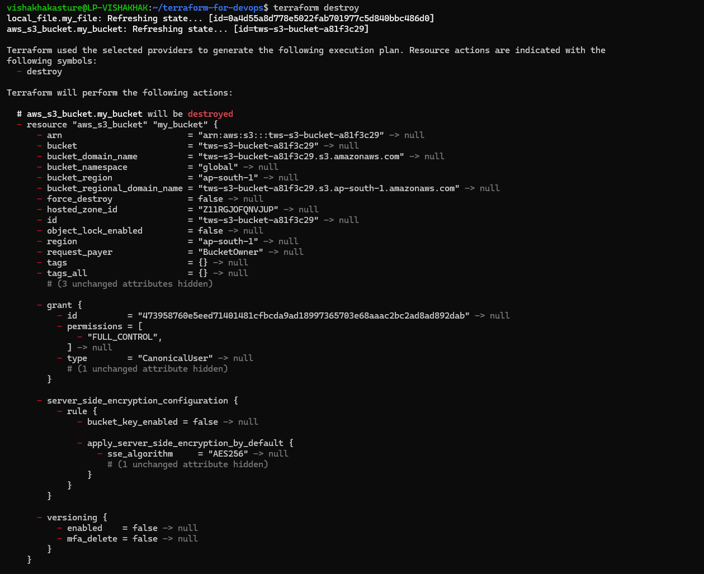

# terraform-aws-s3-iac
AWS S3 Bucket Deployment Using Terraform

A hands-on AWS Infrastructure as Code (IaC) project demonstrating the creation and management of an Amazon S3 bucket using Terraform and the AWS provider.

Technologies
AWS S3
Terraform
AWS CLI
Git
GitHub
Project Overview

This project demonstrates how to create an Amazon S3 bucket on AWS using Terraform instead of manually creating the resource through the AWS Management Console.

The project covers the basic Terraform workflow, including initializing Terraform, formatting the configuration, validating the configuration, creating an execution plan, applying the configuration, and verifying the created S3 bucket in the AWS Management Console.

-  AWS Resource
Resource	Details
Service	- Amazon S3
Resource -	S3 Bucket
Bucket Name -	tws-s3-bucket-a81f3c29
AWS Region -	ap-south-1
Management Tool -	Terraform

-> Implementation
1. Created Terraform Configuration

Created a main.tf file containing:

Terraform required provider configuration
AWS provider configuration
AWS region configuration
Amazon S3 bucket resource
  
2. Configured AWS Provider

Configured the AWS provider to use the Mumbai AWS region:

provider "aws" {
  region = "ap-south-1"
}

3. Defined S3 Bucket Resource

Created an S3 bucket using the Terraform AWS provider:

resource "aws_s3_bucket" "my_bucket" {
  bucket = "tws-s3-bucket-a81f3c29"
}

4. Initialized Terraform

Initialized the Terraform working directory using:

terraform init

This downloaded and initialized the required AWS provider.

5. Formatted Terraform Configuration

Formatted the Terraform configuration using:

terraform fmt

6. Validated Terraform Configuration

Validated the Terraform configuration using:

terraform validate

Expected result:

Success! The configuration is valid.

7. Created Terraform Plan
Created an execution plan using:

terraform plan

Terraform displayed the infrastructure changes that would be made.

Expected result for a new resource:

Plan: 1 to add, 0 to change, 0 to destroy.

8. Applied Terraform Configuration

Applied the Terraform configuration using:

terraform apply

Confirmed the operation by entering:

yes

Terraform then created the S3 bucket in AWS.

9. Verified the S3 Bucket

Verified the created S3 bucket through the AWS Management Console.

The bucket created by Terraform was:

tws-s3-bucket-a81f3c29

Terraform Workflow
Terraform Configuration
        ↓
terraform init
        ↓
terraform fmt
        ↓
terraform validate
        ↓
terraform plan
        ↓
terraform apply
        ↓
AWS S3 Bucket
        ↓
AWS Management Console

- Destroying the Resource

When the S3 bucket is no longer required, the infrastructure can be removed using:

terraform destroy

Confirm the operation when prompted:

yes

This removes the AWS resources managed by the Terraform configuration.

Result

Successfully created an Amazon S3 bucket using Terraform and verified the resource through the AWS Management Console.

The project demonstrates the basic Infrastructure as Code workflow:

Define → Initialize → Format → Validate → Plan → Apply → Verify
Status

Completed
